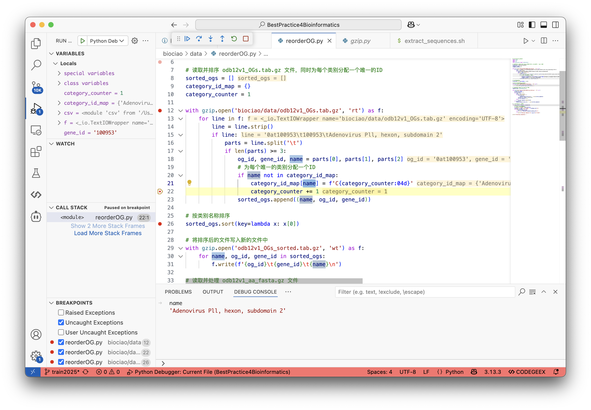
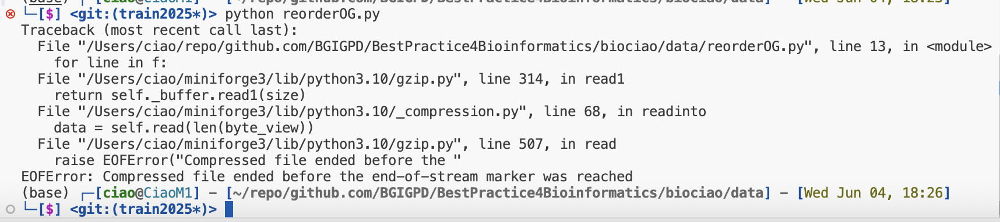
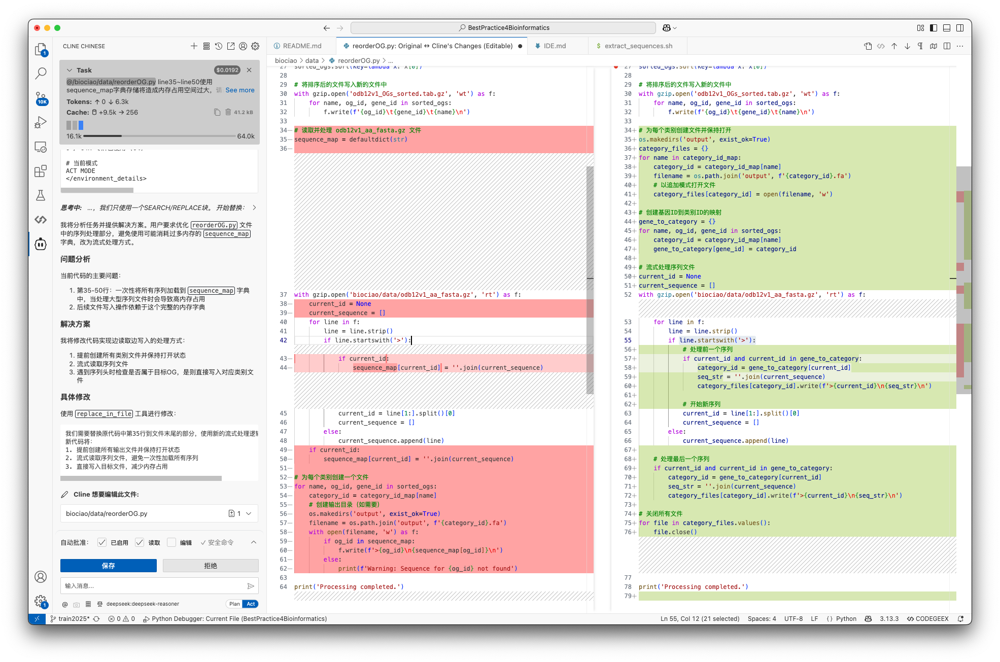

# AI powered IDE ease your coding's pain

> 本章学习以下内容
> - 代码开发过程
> - 集成开发环境（IDE）
> - AI 辅助编程
> - 初学者使用 AI 辅助编程的注意事项

## Introduction  

信息时代，代码开发已成为推动科技进步与创新的关键力量。代码开发，是指运用特定的编程**语言**，遵循一定的**语法**规则和**逻辑**结构，将人类的**思想**和解决问题的步骤转化为计算机可执行的指令序列的过程。它涵盖了从简单的脚本编写到复杂软件系统的构建，是实现各种应用程序和功能的核心手段。无论是日常使用的手机软件、网站服务，还是科研领域的数据分析、模型模拟，都离不开代码开发的支撑。

随着代码开发的复杂度不断增加，集成开发环境（IDE）应运而生并成为程序员不可或缺的得力助手。IDE 是为代码开发量身打造的综合性软件平台，集成了代码编辑器、编译器、调试器以及各种开发工具等多种功能模块。它为开发者提供了一个高效、便捷且统一的工作环境，<u>使得代码编写、运行和调试可以在同一界面下完成</u>，极大地提高了开发效率和质量。

而近年来，AI 辅助编程技术的兴起更是为代码开发带来了前所未有的变革与提升。AI 辅助编程借助先进的人工智能技术，如机器学习、自然语言处理等，深入理解代码语义和开发者的意图。在代码编写过程中，AI 能够实时提供智能代码补全建议，根据上下文自动推荐合适的代码片段、函数名称和参数配置，从而加速代码的生成速度，减少因记忆不准确或手动输入错误导致的语法问题。同时，AI 还具备代码错误检测与修复能力，能够在代码运行之前提前发现潜在的逻辑漏洞和错误，并给出详细的提示信息以及可能的修复方案，有效地降低了调试成本和开发风险。此外，AI 亦可协助进行代码优化与重构，通过分析代码结构和性能瓶颈，为开发者提供针对性的优化建议，使代码更加高效、优雅且符合最佳实践标准。

然而对于初学者来说，由于 AI 辅助编程工具的强大功能可能会逐渐形成过度依赖的习惯。他们可能会在未经深入思考的情况下，直接使用 AI 生成的代码，而缺乏对代码背后逻辑和原理的理解。例如当面对 AI 提供的复杂代码或难以理解的建议时，初学者可能会感到迷茫和困惑。他们不知道如何将这些内容应用到实际项目中，或者无法判断 AI 提供的方案是否符合自己的需求，从而影响了学习和开发的效率。而长期过度依赖 AI 也会导致初学者在面对一些复杂的问题或 AI 无法准确理解需求的情况时，感到束手无策。他们难以独立进行代码调试和优化，一旦脱离 AI 辅助环境，编程能力就会受到很大限制，难以真正成长为具备独立开发能力的程序员。因此，在学习应用AI辅助编程的同时，我们也要注意把握好效率与学习之间的平衡。


## 从问题出发

OrthoDB 是一个综合性的直系同源物数据库，提供了涵盖真核生物、原核生物和病毒的直系同源物的进化和功能注释。它提供了非常方便直观的数据下载方式，便于在各个作业环境下准备数据。访问地址： https://www.orthodb.org

下载`README.txt`

```
$ wget https://data.orthodb.org/current/download/README.txt

$ grep -A 3 odb12v1_OGs.tab README.txt
...
odb12v1_levels.tab:
1.	level NCBI tax id
2.	scientific name
3.	total non-redundant count of genes in all underneath clustered species
4.	total count of OGs built on it
5.	total non-redundant count of species underneath

odb12v1_level2species.tab
1.	top-most level NCBI tax id, one of {2, 2157, 2759, 10239}
2.	Ortho DB organism id
3.	number of hops between the top-most level id and the NCBI tax id assiciated with the organism
4.	ordered list of Ortho DB selected intermediate levels from the top-most level to the bottom one

```

下载`odb12v1_OGs.tab.gz`

```
$ wget https://data.orthodb.org/current/download/odb12v1_OGs.tab.gz
$ gzip -dc odb12v1_gene_xrefs.tab.gz|head
100_0:000000	GO:0016020	GOterm
100_0:000000	GO:0005886	GOterm
100_0:000000	GO:0000166	GOterm
100_0:000000	GO:0016887	GOterm
100_0:000000	GO:0005524	GOterm
100_0:000000	IPR017871	InterPro
100_0:000000	IPR003439	InterPro
100_0:000000	IPR003593	InterPro
100_0:000000	IPR027417	InterPro
100_0:000000	WP_131833652.1	NCBIproteinAcc
```

同理下载`odb12v1_aa_fasta.gz`

```bash
$ wget https://data.orthodb.org/current/download/odb12v1_aa_fasta.gz
$ gzip -dc odb12v1_aa_fasta.gz|head
>100_0:000000	100_0
MVDPARPAPAGALWSLCEVAFTLGERAILSPLTLDLPAGRVYGLIGPNGSGKSTLLKMMARQLAPSSGELRFDDRPLGAWSGRAFAREVAYMPQFMPASDGMNVRELVSLGRYPWHGALGRFSPEDEARVEAAIQRAGLAPFRERAVDSLSGGERQRAWLALMLAQGARCLLLDEPTSALDIAHQMEVLAILRELGGEAAGGPGQAGAMTVIVILHDINLAARTCDALLALRGGRLLAHGPCDEIMEPERLRAIYGLDMGVMAHPVSGTPMSYVL
>100_0:000001	100_0
MTARTPTRSARRLALGGFIAASLALAPFAAMAEEVVNIYTTREPGLAKPLFDAFTEKTGVKVNSVFVKDGLAERVKAEGAASPADVLMTVDVGALLDLVDQGVTQPVKSDVLEKAIPANLRGPDGGWFALSARARVAYTSKDRVKDTAITYESFADPKWKGEVCIRSGKHPYNTALIAAYIVHHGEAKAEEWLKGVKANLARKAAGGDREVARDILGDICDLGLANSYYVGLMRSGKGGPEQEEWAKAINVVLPTFENGGTHVNISGATVAKNAPNKDNAVKLLEYLVSPEAQDLYAKGNFEYPVVPGAPVDPIIAAFGPLKVDNVDLVAVAKARKAATNLADKVGFDN
>100_0:000002	100_0
MGAEAVSGDAKRAPAAALRPALPGDVPMLAAIAEAAILELTGEDYDTDQQEAWAAAASDEEALAARLKDQLTLVATRDGEVMGFIALADNKLIDMLYVRPEAVGEGVASLLYDAIERLAGARGAKSLTVDASDTALDFFSTRGFAPKQRNTLSLGGVWLANTTMEKLLGPPEGSVH
>100_0:000003	100_0
MTFASLRSFGFWSLVVAILTYMTLPTLVVLMTSVNPTEILAFPPEGVSFAWYEKALTYPDFRRAFTNGLIVTSLASTLAVVVGSAFAWLIHRYEFRGRGVLEAVLWSPLIIPHFTLGFGFLLLGGAFKLQQGYVMIVLAHMVLVMPFVTRAVYVSLATIDPNLARAAANLGASPFHVLTRIELPLVLPGMAGGWLIAAVLSLTEFTASLYVTGSRTQTLPVAMYNYIREYADPTVSAVSAMLIITTTLIMFIADRAFGLRRVLAIDTH
>100_0:000004	100_0
MPTTPTTLAQRPALNLLLALAMLVAGPVAAWAQVQQPAPALSTPAPATPAPATPAPATTTPSAPATAAPVPAAPAPSTPAPAVDPLVPPAPGMTAPATGGQVSPPAGDAATAVPPAAAPAGDAPVVAPAAGEVSADPSLSGLPLDQSEDPSVAAQLPHDLSPWGMFMAADWVVKAVMIGLAFASVVTWTVWLAKTMELAVAKGRLRRALKGYLASATLDEARRVDPRGPAGAMLRTTDLELQRSGPLPADGIKERVSISLSRIEVAAGRAITRGTGLLATIGATAPFVGLFGTVWGIMNSFIGISKAQTTNLAVVAPGIAEALLATAIGLVAAIPAVVIYNHFSRQVSGYRVLMGDASAEVLRLLSRDLDRRDASRSAAHRVRTAAE
```


### Question: 如何按照同源家族排列，将相同家族的序列保存到各自的文件中？


#### 尝试1: 借助大模型提问

Review kimi : https://www.kimi.com/share/d104iof60ra02d3rauog

关键点：

1. 完善明确的提问

   - 补充背景
   - 明确目标

2. 理解思考过程

3. 理解脚本逻辑

4. 验证执行结果

   - 测试验证

   - 交叉验证

执行出现如下问题：

- 由于第三列内容中个别记录存在特殊字符，导致文件名异常
- 执行时间长、效率低下（低效的循环）


#### 尝试2: 针对问题补充改进

Review kimi ： https://www.kimi.com/share/d105261l51jcqn3udspg

#### Test & Debug

1. 方法1: 在vscode中使用debug功能
2. 设置print报告
3. 代码解释



执行后发现如下报错：



这是由于文件不完整导致的，可以修正文件：

```
$ gzip -dc odb12v1_aa_fasta.gz | gzip > odb12v1_aa_fasta_fix.gz

$ gzip -dc odb12v1_OGs_sorted.tab.gz | gzip > odb12v1_OGs_sorted.tab_fix.gz
```

在脚本中更新文件名后再次执行


### develop 改进代码

关键：找到问题或需求

使用cline等工具：Cline 是一款开源的 AI 编程助手，作为 Visual Studio Code (VS Code) 的扩展插件，它集成了多种 AI 大模型，如 Anthropic 公司的 Claude 系列模型、OpenAI 等，旨在帮助开发者提升编程效率，解决复杂问题。此外，Cline Chinese 是 Cline 的中文版本，其安装方式与 Cline 类似，主要优势在于为中文用户提供了更友好的界面和使用体验。

- 从vscode插件市场中搜索并安装
- 获取LLM API （如deepseek的API开放平台 https://www.deepseek.com）
- 提问：

> @/biociao/data/reorderOG.py line35~line50使用sequence_map字典存储将造成内存占用空间过大，请改为边读取边写入的方式处理序列文件。



测试发现报错：`OSError: [Errno 24] Too many open files: 'output/C61437.fa'`

将报错信息交给cline继续优化。测试结果。

反复迭代优化，完成开发。


# 总结

代码开发主要阶段都可以利用LLM提速：
    1. 需求分析：明确问题  
    2. 系统设计：确定框架和实现语言  
    3. 代码实现：  
        1. 环境部署  
        2. 代码编写 <-> 审查 <-> 测试
        3. 代码部署  
    4. 迭代与维护  

# 作业

从自己的实际项目中找到代码开发需求，实践上述工具和技巧。