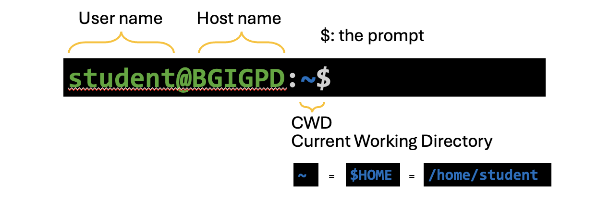
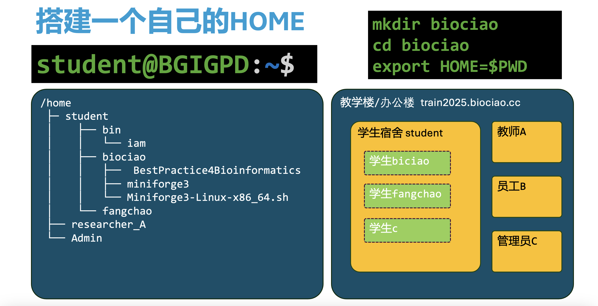
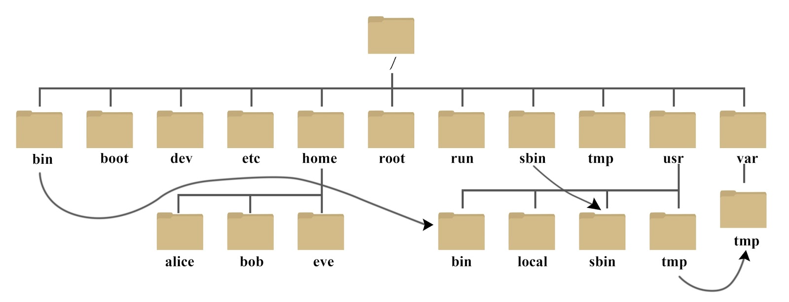
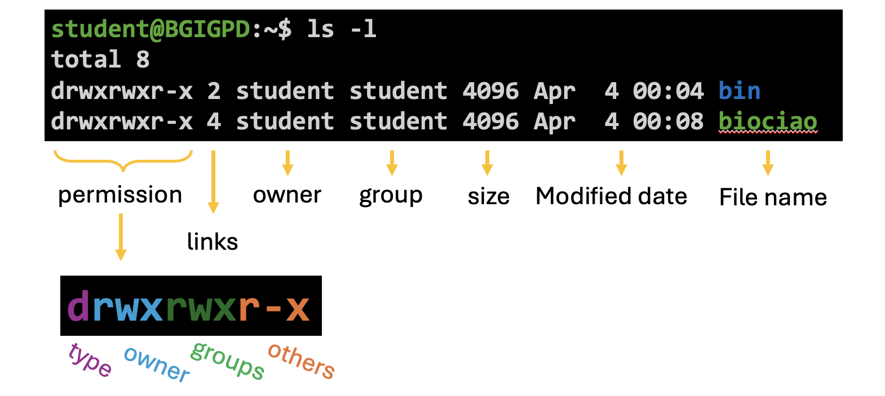

# Login A Linux OS and 'decorate' your Home

## Requirement / tools

For windows user, you can use [PuTTY](https://www.chiark.greenend.org.uk/~sgtatham/putty/latest.html) or [MobaXterm](https://mobaxterm.mobatek.net/).

For Mac user, you can use [iTerm2](https://iterm2.com/) or just use the default terminal.

Recommend: use [VSCode](https://code.visualstudio.com/) with [Remote - SSH](https://marketplace.visualstudio.com/items?itemName=ms-vscode-remote.remote-ssh) extension.

## Login

### Login with SSH

```bash
ssh student@train2025.biochao.cc
```

## Where am I?


## 搭建一个自己的HOME

```bash
mkdir biociao
cd biociao
export HOME=$PWD
```


## Know the Linux file system

```bash
$ tree -L 1 /
/
├── bin -> usr/bin
├── bin.usr-is-merged
├── boot
├── cdrom
├── CloudrResetPwdAgent
├── dev
├── etc
├── home
├── lib -> usr/lib
├── lib64 -> usr/lib64
├── lib.usr-is-merged
├── lost+found
├── media
├── mnt
├── opt
├── proc
├── root
├── run
├── sbin -> usr/sbin
├── sbin.usr-is-merged
├── snap
├── srv
├── sys
├── tmp
├── usr
└── var
```

> 目之所及，皆为文件



### File types

#### Regular file

普通文件是存储数据或文本的文件，是最常见的文件类型。它们可以包含任何类型的数据，如文本文件、图片、音频文件、视频文件等。

#### Directory

目录是一种特殊的文件，用于组织和存储其他文件和目录。目录是文件系统中的树形结构的基础。

#### Link  

链接是一种特殊的文件，用于指向另一个文件或目录。链接分为两种类型：硬链接（Hard Link）和软链接（Symbolic Link 或 Soft Link）。

#### Device File  

设备文件用于表示系统中的硬件设备。

#### Pipe File / FIFO
管道文件是一种特殊的文件，用于进程间通信。它允许一个进程将数据写入管道，而另一个进程从管道中读取数据。

#### Socket File  

套接字文件用于网络通信或进程间通信。它允许不同进程之间通过网络协议进行通信。

### Path

在 Linux 系统中，路径是用来定位文件和目录的一种方式，它对文件系统的组织和管理起着重要作用。

#### Absolute Path

绝对路径是指从根目录（/）开始的完整路径，它能够唯一地标识系统中的一个文件或目录。无论当前工作目录是什么，绝对路径都能准确地找到目标文件或目录。例如：
- /home/student/.bashrc 表示从根目录开始，经过 home 目录，再进入 student 用户的家目录，最后到达 .bashrc 文件夹中的 file.txt 文件。 
- /usr/bin 是一个常见的绝对路径，表示系统中存放可执行文件的目录。
绝对路径的优点是明确且唯一，不会因当前工作目录的变化而改变。它常用于在脚本中指定文件或目录的精确位置，确保程序能够正确地找到目标资源。

#### Relative Path

相对路径是从当前工作目录开始的路径，它依赖于当前的工作目录。相对路径的起点是当前目录，通过一系列的目录层级来定位目标文件或目录。例如：
- 如果当前工作目录是 /home/student/biociao，那么 ./miniforge3/LICENSE.txt 就是一个相对路径，它表示从当前目录进入 miniforge3 文件夹，找到 LICENSE.txt 文件。
- ./Miniforge3-Linux-x86_64.sh 表示当前目录下的 Miniforge3-Linux-x86_64.sh 文件。其中 . 表示当前目录。
- ../bin 表示当前目录的上一级目录中的 bin 目录。其中 .. 表示上一级目录。  

相对路径的优点是灵活性较高，特别是在处理同一目录下的文件或子目录时，使用相对路径可以避免路径冗长。但它也有局限性，因为它的含义依赖于当前工作目录，如果当前目录发生变化，相对路径可能会失效。

### File permission



符号表示法使用字符来表示权限：
- 读权限（r）：用字符 r 表示    (4 or 100)。
- 写权限（w）：用字符 w 表示    (2 or 010)。
- 执行权限（x）：用字符 x 表示  (1 or 001)。
- 无权限（-）：用字符 - 表示。

### Environment Variable

```bash
$ env
SHELL=/bin/bash
HISTSIZE=1000
HISTTIMEFORMAT=%F %T student
PWD=/home/student
LOGNAME=student
XDG_SESSION_TYPE=tty
HOME=/home/student
LANG=en_US.UTF-8
LS_COLORS=rs=0:di=01;34:ln=01;36:mh=00:pi=40;33:so=01;35:do=01;35:bd=40;33;01:cd=40;33;01:or=40;31;01:mi=00:su=37;41:sg=30;43:ca=00:tw=30;42:ow=34;42:st=37;44:ex=01;32:*.tar=01;31:*.tgz=01;31:*.arc=01;31:*.arj=01;31:*.taz=01;31:*.lha=01;31:*.lz4=01;31:*.lzh=01;31:*.lzma=01;31:*.tlz=01;31:*.txz=01;31:*.tzo=01;31:*.t7z=01;31:*.zip=01;31:*.z=01;31:*.dz=01;31:*.gz=01;31:*.lrz=01;31:*.lz=01;31:*.lzo=01;31:*.xz=01;31:*.zst=01;31:*.tzst=01;31:*.bz2=01;31:*.bz=01;31:*.tbz=01;31:*.tbz2=01;31:*.tz=01;31:*.deb=01;31:*.rpm=01;31:*.jar=01;31:*.war=01;31:*.ear=01;31:*.sar=01;31:*.rar=01;31:*.alz=01;31:*.ace=01;31:*.zoo=01;31:*.cpio=01;31:*.7z=01;31:*.rz=01;31:*.cab=01;31:*.wim=01;31:*.swm=01;31:*.dwm=01;31:*.esd=01;31:*.avif=01;35:*.jpg=01;35:*.jpeg=01;35:*.mjpg=01;35:*.mjpeg=01;35:*.gif=01;35:*.bmp=01;35:*.pbm=01;35:*.pgm=01;35:*.ppm=01;35:*.tga=01;35:*.xbm=01;35:*.xpm=01;35:*.tif=01;35:*.tiff=01;35:*.png=01;35:*.svg=01;35:*.svgz=01;35:*.mng=01;35:*.pcx=01;35:*.mov=01;35:*.mpg=01;35:*.mpeg=01;35:*.m2v=01;35:*.mkv=01;35:*.webm=01;35:*.webp=01;35:*.ogm=01;35:*.mp4=01;35:*.m4v=01;35:*.mp4v=01;35:*.vob=01;35:*.qt=01;35:*.nuv=01;35:*.wmv=01;35:*.asf=01;35:*.rm=01;35:*.rmvb=01;35:*.flc=01;35:*.avi=01;35:*.fli=01;35:*.flv=01;35:*.gl=01;35:*.dl=01;35:*.xcf=01;35:*.xwd=01;35:*.yuv=01;35:*.cgm=01;35:*.emf=01;35:*.ogv=01;35:*.ogx=01;35:*.aac=00;36:*.au=00;36:*.flac=00;36:*.m4a=00;36:*.mid=00;36:*.midi=00;36:*.mka=00;36:*.mp3=00;36:*.mpc=00;36:*.ogg=00;36:*.ra=00;36:*.wav=00;36:*.oga=00;36:*.opus=00;36:*.spx=00;36:*.xspf=00;36:*~=00;90:*#=00;90:*.bak=00;90:*.crdownload=00;90:*.dpkg-dist=00;90:*.dpkg-new=00;90:*.dpkg-old=00;90:*.dpkg-tmp=00;90:*.old=00;90:*.orig=00;90:*.part=00;90:*.rej=00;90:*.rpmnew=00;90:*.rpmorig=00;90:*.rpmsave=00;90:*.swp=00;90:*.tmp=00;90:*.ucf-dist=00;90:*.ucf-new=00;90:*.ucf-old=00;90:
LC_TERMINAL=iTerm2
SSH_CONNECTION=111.199.109.170 1966 172.31.0.122 22
LESSCLOSE=/usr/bin/lesspipe %s %s
XDG_SESSION_CLASS=user
TERM=xterm-256color
LESSOPEN=| /usr/bin/lesspipe %s
USER=student
LC_TERMINAL_VERSION=3.5.11
SHLVL=1
XDG_SESSION_ID=20
XDG_RUNTIME_DIR=/run/user/1000
SSH_CLIENT=111.199.109.170 1966 22
XDG_DATA_DIRS=/usr/local/share:/usr/share:/var/lib/snapd/desktop
PATH=/home/student/bin:/home/student/bin:/usr/local/sbin:/usr/local/bin:/usr/sbin:/usr/bin:/sbin:/bin:/usr/games:/usr/local/games:/snap/bin
DBUS_SESSION_BUS_ADDRESS=unix:path=/run/user/1000/bus
SSH_TTY=/dev/pts/0
_=/usr/bin/env
```


# Homework

Login to the server:
```bash
ssh student@train2025.biochao.cc
```

After login, create your own HOME directory.

Note: Replace `biociao` with your own name.

Create a directory in your name.
```bash
mkdir biociao
```

Enter this directory.
```bash
cd biociao
```

Create a bash profile
```bash
echo "export HOME=/home/student/biociao"  >> .bashrc
```

Source your bash profile. This will change your HOME directory.
```bash
source .bashrc
```

Install mamba

```bash
bash ../biociao/Miniforge3-Linux-x86_64.sh
```

After that, re-login and do following operations:
```bash
# Note：You need to do this everytime you login.
cd biociao
source .bashrc
```

That will allow you to set up your own configurations.

Reading extra knowledge about linux operations. Here are some recommendations:  

- [鸟哥私房菜](https://linux.vbird.org) 
- [Linux Journey](https://linuxjourney.com) 
